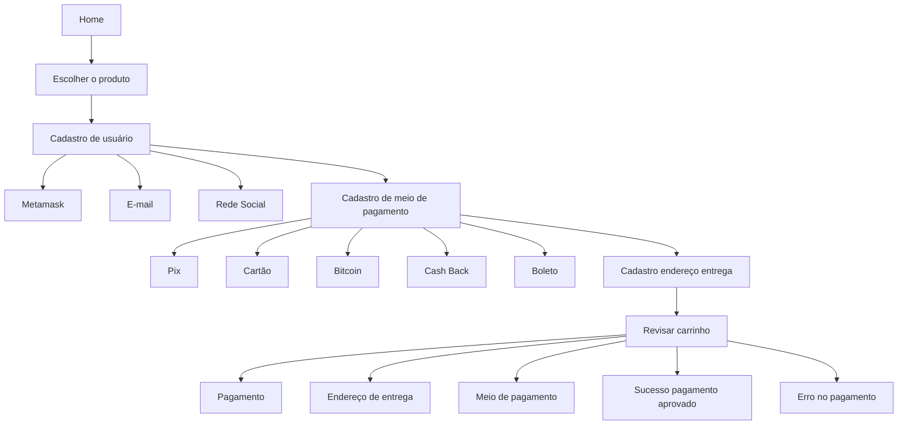

# Dappazon

## Technology Stack & Tools

- Solidity (Writing Smart Contracts & Tests)
- Javascript (React & Testing)
- [Hardhat](https://hardhat.org/) (Development Framework)
- [Ethers.js](https://docs.ethers.io/v5/) (Blockchain Interaction)
- [React.js](https://reactjs.org/) (Frontend Framework)

## Requirements For Initial Setup
- Install [NodeJS](https://nodejs.org/en/)

## Setting Up

### 1. Clone/Download the Repository

### 2. Install Dependencies:
`$ yarn install`

### 3. Run tests
`$ yarn test`

### 4. Start Hardhat node
`$ npx hardhat node`

### 5. Run deployment script
In a separate terminal execute:
`$ npx hardhat run ./scripts/deploy.js --network localhost`

### 6. Start frontend
`$ npm run start`

### 7. Conecte sua Metamask na sua rede local

Conecte-se à Rede Local:

No canto superior direito da MetaMask, clique no menu suspenso que mostra a rede atual (por exemplo, "Main Ethereum Network").

Selecione "Custom RPC" ou "Rede Local" (dependendo da sua versão da MetaMask).

Insira as seguintes informações:
* Network Name: Hardhat (ou qualquer nome que você preferir)
* New RPC URL: http://127.0.0.1:8545 (este é o padrão para o Hardhat node)
* Chain ID: 31337 (este é o padrão para o Hardhat node)

Clique em "Save" ou "Salvar".

## 8

npx hardhat console --network localhost

## Jornadas de usuário

Jornada inicial, usuário não cadastrado

* 

