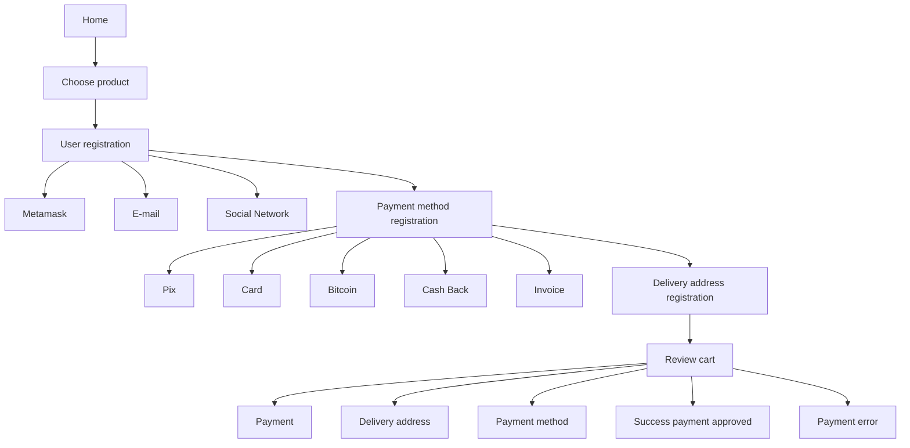

Here's the translated README:

# Dappazon

Endereços do nosso contrato:

Goerli Test : 0x62Ff16877fc496CB44c7feBF4b1C16b13D91370E

**Dappazon: A Revolução do E-commerce Personalizado**

Apresentando o Dappazon - a vanguarda das soluções de e-commerce. Uma plataforma inovadora que redefine a maneira como você visualiza, cria e gerencia sua loja online. Com o Dappazon, você não é apenas um usuário; você é um criador, um visionário e um empreendedor.

**Características Principais:**

1. **Crie Sua Loja Virtual:** Com ferramentas intuitivas, o Dappazon permite que você estabeleça sua presença online, criando lojas virtuais que refletem sua marca e visão. Desde a seleção de produtos até a criação de vitrines atraentes, oferecemos tudo o que você precisa para começar.

2. **Experiência Completa de E-commerce:** Não é apenas sobre vender; é sobre proporcionar uma experiência. Com o Dappazon, você oferece aos seus clientes uma jornada de compra imersiva, completa com todas as funcionalidades que eles esperam de um e-commerce de ponta.

3. **Flexibilidade Inigualável:** Use nossa plataforma para hospedar sua loja online e aproveite a infraestrutura robusta e confiável que oferecemos. Ou, se preferir uma abordagem mais personalizada, copie nosso repositório e molde-o de acordo com suas necessidades específicas.

4. **Open Source e Personalizável:** Acreditamos no poder da comunidade e na liberdade de escolha. Por isso, o Dappazon é open source. Pegue nosso código, adapte-o, melhore-o e crie uma loja online que seja verdadeiramente sua.

**Por que escolher o Dappazon?**

Em um mundo onde o e-commerce se tornou a norma, o Dappazon se destaca como uma solução que coloca o poder nas mãos dos usuários. Seja você um empreendedor iniciante buscando estabelecer sua primeira loja online ou uma grande empresa buscando uma solução personalizada, o Dappazon é a plataforma que atende a todas as suas necessidades.

Junte-se à revolução do e-commerce. Descubra o Dappazon e crie a loja online dos seus sonhos.

## Technology Stack & Tools

- Solidity (Writing Smart Contracts & Tests)
- Javascript (React & Testing)
- [Hardhat](https://hardhat.org/) (Development Framework)
- [Ethers.js](https://docs.ethers.io/v5/) (Blockchain Interaction)
- [React.js](https://reactjs.org/) (Frontend Framework)

## Requirements For Initial Setup
- Install [NodeJS](https://nodejs.org/en/)

## Setting Up

### 1. Clone/Download the Repository

### 2. Install Dependencies:
`$ yarn install`

### 3. Run tests
`$ yarn test`

### 4. Start Hardhat node
`$ yarn run node`

### 5. Run deployment script
In a separate terminal execute:
`$ yarn run deploy-local`

### 6. Start frontend
`$ yarn run start`

### 7. Connect your Metamask to your local network

Connect to the Local Network:

In the top right corner of MetaMask, click on the dropdown menu showing the current network (for example, "Main Ethereum Network").

Select "Custom RPC" or "Local Network" (depending on your version of MetaMask).

Enter the following details:
* Network Name: Hardhat (or any name you prefer)
* New RPC URL: http://127.0.0.1:8545 (this is the default for the Hardhat node)
* Chain ID: 31337 (this is the default for the Hardhat node)

Click on "Save".

## How to access your local node

npx hardhat console --network localhost

## How to configure your deployment secrets

To deploy and interact with blockchain networks, certain secrets and keys are required. Here are steps on how to obtain and configure them:

### 1. **INFURA_API_KEY**:
   - **How to obtain**:
     1. Go to [Infura](https://www.infura.io/).
     2. Sign up for an account if you don't already have one.
     3. Once logged in, create a new project.
     4. Within the project settings, you will see your API keys.
   - **How to configure**:
     - Store this key in a `.env` file in the root directory of your project as:
       ```
       INFURA_API_KEY=your_infura_api_key
       ```

### 2. **PRIVATE_KEY**:
   - **How to obtain**:
     1. Open your Metamask extension.
     2. Click on the account icon (usually at the top right).
     3. Click on "Account Details".
     4. Under the "Private Key" section, click "Export Private Key".
     5. Enter your Metamask password and then you will be shown your private key. **(Caution: Never share this key!)**.
   - **How to configure**:
     - Store this key in your `.env` file:
       ```
       PRIVATE_KEY=your_metamask_private_key
       ```

### 3. **VERCEL_TOKEN**:
   - **How to obtain**:
     1. Visit [Vercel](https://vercel.com/).
     2. Sign in or create an account.
     3. Go to your settings or dashboard.
     4. Navigate to the "Tokens" section.
     5. Generate a new token.
   - **How to configure**:
     - Store the token in your `.env` file:
       ```
       VERCEL_TOKEN=your_vercel_token
       ```

### Security Note:
Always make sure to add `.env` to your `.gitignore` file to ensure that it isn't accidentally committed to a public repository, as it contains sensitive information.


## User Journeys

Initial journey, unregistered user:

*



## Funcionalidades

Esse projeto é uma potente plataforma de ecommerce e facilitação do comercio com transparencia, auta disponibilidade e auditável plataforma de ecommerce.

Aqui proteção e sigilo de dados é lei (lei de proteção aos dados).

+ (base) - White Label (Esse módulo é a base do sistema, pois aqui iremos cadastrar as lojas parceiras)

    * Cadastro de Loja
        * Criação Vitrines / Categorias
        * Gestão de conteudo
        * SAC
        * Area logada
        * Taxa
        * Divição de lucros
        [*] Notificações
        [*] Ferramentas de engajamento
            [*] Rede social
            [*] Blog

+ (base) - Usuários

    * Tipo de usuário (Client, Lojista (Seller), Back_Office, Owner)
      > Focado na Lei de proteção de dados os acessos aos dados dessa plataforma seguem a seguinte diretriz

      Tabela entidade vs read_write | role

      * private Client (Owner read_write, Seller read, Back_Office read)
      * public Seller (Owner read_write, Client read, Back_Office read)
      * private Back_Office (Seller read_write, Client read, Back_Office read)
      * private Owner (Seller read_write, Client read, Back_Office read)

+ (plugin) - Marketing Place (Cadastro de Produtos / Taxas de pagamento / Fluxo fácil de Checkout)

    * Cadastro
        * Produtos
        * Categorias

    * Checkout
    * Gateway de Pagamento
    * Carrinho de compras
    * Cupom de desconto (extra)

+ (plugin) - Marketing Place School Courses (Dependes on Marketing Place)

    * NFT - Acess
    * Larning Plataform
    *

+ (plugin) - Marketing Place Events

    * Tkt NFT Manager
    * Events manager
    * Tkt Check (app mobile, dapp)

+ (plugin) - Marketing Place Gift Card

    * Coin Manager

# Designer : Style site Layout

[_] - Tipo cores (verde e amarelo, roxo e verde)
[_] - Tema (tec, oriental, business)
[_] - Logo (simbol, by artist Pablo Picasso, style Psicodelicy)
[_] - Site Layout (ex: Menu, Bunner, Product List (10 itens page), Footer)
[_] - Site Detail (Menu -> About us, Products, Programa de Fidelidade, Footer)
