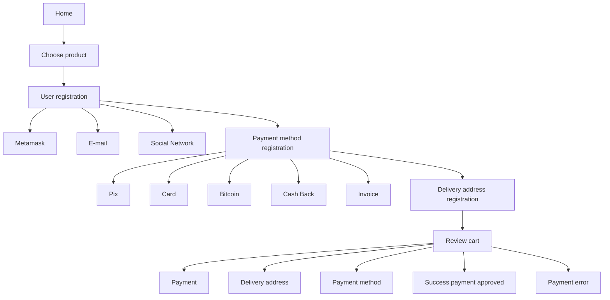

Here's the translated README:

# Dappazon

## Technology Stack & Tools

- Solidity (Writing Smart Contracts & Tests)
- Javascript (React & Testing)
- [Hardhat](https://hardhat.org/) (Development Framework)
- [Ethers.js](https://docs.ethers.io/v5/) (Blockchain Interaction)
- [React.js](https://reactjs.org/) (Frontend Framework)

## Requirements For Initial Setup
- Install [NodeJS](https://nodejs.org/en/)

## Setting Up

### 1. Clone/Download the Repository

### 2. Install Dependencies:
`$ yarn install`

### 3. Run tests
`$ yarn test`

### 4. Start Hardhat node
`$ npx hardhat node`

### 5. Run deployment script
In a separate terminal execute:
`$ npx hardhat run ./scripts/deploy.js --network localhost`

### 6. Start frontend
`$ npm run start`

### 7. Connect your Metamask to your local network

Connect to the Local Network:

In the top right corner of MetaMask, click on the dropdown menu showing the current network (for example, "Main Ethereum Network").

Select "Custom RPC" or "Local Network" (depending on your version of MetaMask).

Enter the following details:
* Network Name: Hardhat (or any name you prefer)
* New RPC URL: http://127.0.0.1:8545 (this is the default for the Hardhat node)
* Chain ID: 31337 (this is the default for the Hardhat node)

Click on "Save".

## How to access your local node

npx hardhat console --network localhost

## How to configure your deployment secrets

To deploy and interact with blockchain networks, certain secrets and keys are required. Here are steps on how to obtain and configure them:

### 1. **INFURA_API_KEY**: 
   - **How to obtain**:
     1. Go to [Infura](https://www.infura.io/).
     2. Sign up for an account if you don't already have one.
     3. Once logged in, create a new project.
     4. Within the project settings, you will see your API keys.
   - **How to configure**:
     - Store this key in a `.env` file in the root directory of your project as:
       ```
       INFURA_API_KEY=your_infura_api_key
       ```

### 2. **PRIVATE_KEY**: 
   - **How to obtain**:
     1. Open your Metamask extension.
     2. Click on the account icon (usually at the top right).
     3. Click on "Account Details".
     4. Under the "Private Key" section, click "Export Private Key".
     5. Enter your Metamask password and then you will be shown your private key. **(Caution: Never share this key!)**.
   - **How to configure**:
     - Store this key in your `.env` file:
       ```
       PRIVATE_KEY=your_metamask_private_key
       ```

### 3. **VERCEL_TOKEN**: 
   - **How to obtain**:
     1. Visit [Vercel](https://vercel.com/).
     2. Sign in or create an account.
     3. Go to your settings or dashboard.
     4. Navigate to the "Tokens" section.
     5. Generate a new token.
   - **How to configure**:
     - Store the token in your `.env` file:
       ```
       VERCEL_TOKEN=your_vercel_token
       ```

### Security Note:
Always make sure to add `.env` to your `.gitignore` file to ensure that it isn't accidentally committed to a public repository, as it contains sensitive information.


## User Journeys

Initial journey, unregistered user:

* 

