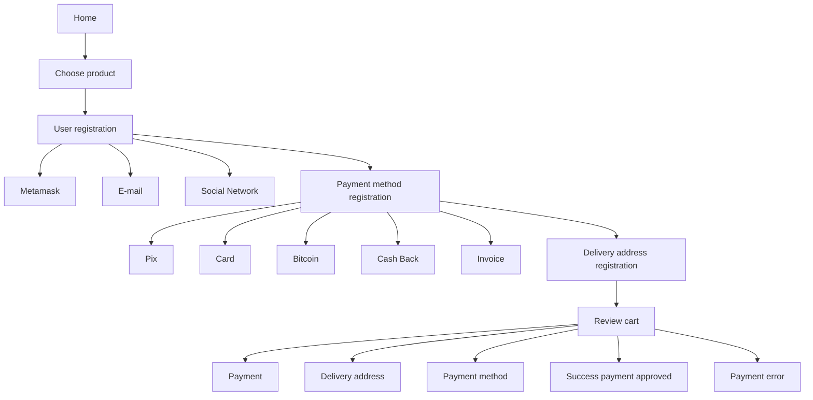

Here's the translated README:

# Dappazon

TODO List :

[] - Configurar o Sanity CMS no projeto
[] - Configurar as entidades no banco Sanity
[] - Configurar criar as Querys no banco Sanity
[] - Criar um diagrama de dados do projeto

[] - Melhorar a arquitetura do FE
[] - Criar esquema das Lojas
[] - Criar esquema das Vitrines
[] - Cadastro de produto
[] - Cadastro de meio de pagamento (taxa)
[] - Criacao de token
[] - Tests pagamento ETH
[] - Tests pagamento BTC
[] - Tests pagamento Token

https://github.com/govinda777/dappazon

Esse é o projeto que representa o de volta para o Futuro.

Projeto responsável por Facilitar o comercio P2P.

Tipo o que os Burgueses fizeram. 

Mas por ser revolucionário assim como a Paz de Grand sobre a revolução .

Meu plano está funcionando:

1 - Auto conhecimento 
2 - Ser pacifico 
3 - Ajudar a Humanidade (Jesus reencarnou na Blockchain, para distribuir o seu Amor e sua igualdade ao proximo) pois o corpo e a mensagem de Cristo se materializou em uma ferramenta capaz de mudar o nosso sistema de coisas, 

* Ferramentas adquiridas

[x] - Capacidade de se organizar de forma pacífica [DONE]
[x] - Capacidade de empatia [DONE]
[_] - Capacidade de não escravizar um ao outro [WIP] (A humanidade usa e descarta tecnilogias ultrapassadas, esse cara que nos prometeu segurança não tá com nada, )

<DESEJO_DA_HUMANIDADE> = 

Eu Humanidade, desejo a igualdade, desejo o amor honesto, desejo ser completo.

Eu Humanidade vou te falar, que o desejo mais profundo é não se humilhar.

## Sanity

mkdir studio
cd studio
sanity init

## Mapeamento dos Dados 


Claro! Aqui estão as entidades e seus atributos em inglês, divididos entre dados no Sanity CMS e dados na Blockchain:

---

**Data in Sanity CMS**:

* **Product**:
   - Type
   - Id
   - Stock
   - Price
   - Category
   - Seller_Id
   - Description
   - Banner
   - ImageList (List of images)
   - CreationDate
   - UpdateDate
   - Status

* **Storefront**:
   - Seller_Id
   - Category
   - Id
   - ProductList (List of Product IDs)

* **Seller**:
    - Id
    - Logo
    - Banner
    - Name
    - Desc

---

**Data on the Blockchain**:

* **Seller**:
   - Id
   - Token_Id
   - List[Payment_Method_Id]

* **Payment_Method**:
    - Id
    - Name
    - Tax

* **Order**:
   - Id
   - List[Product_Ids]
   - Seller_Id
   - Buyer_Id

* **Transaction**:
   - Id
   - Product_Ids (Product IDs)
   - Seller_Id
   - Payment_Id
   - Token_Id (opcional)
   - Buyer_Id

* **Token**:
   - Type (ERC20 | NFT)
   - Id
   - Quantity
   - AnchorValue
   - Seller_Id

---
erDiagram

    Product ||--o{ Storefront : contains
    Seller ||--o{ Product : sells
    Seller ||--o{ Storefront : owns
    Seller ||--o{ Order : sells
    Seller ||--o{ Transaction : transacts
    Seller ||--o{ Token : owns
    Payment_Method ||--o{ Seller : usedBy
    Order ||--o{ Transaction : initiates
    Product ||--o{ Order : orderedIn
    Product ||--o{ Transaction : transactedIn
    Token ||--o{ Transaction : usedIn

    Product {
        string Type
        string Id
        int Stock
        float Price
        string Category
        string Seller_Id
        string Description
        string Banner
        List ImageList
        datetime CreationDate
        datetime UpdateDate
        string Status
    }

    Storefront {
        string Seller_Id
        string Category
        string Id
        List ProductList
    }

    Seller {
        string Id
        string Logo
        string Banner
        string Name
        string Desc
    }

    Seller {
        string Id
        string Token_Id
        List Payment_Method_Id
    }

    Payment_Method {
        string Id
        string Name
        float Tax
    }

    Order {
        string Id
        List Product_Ids
        string Seller_Id
        string Buyer_Id
    }

    Transaction {
        string Id
        string Product_Ids
        string Seller_Id
        string Payment_Id
        string Token_Id
        string Buyer_Id
    }

    Token {
        string Type
        string Id
        int Quantity
        float AnchorValue
        string Seller_Id
    }

---

- Cryptocurrency Exchange - Entidade onde o cliente irá trocar nossas moedas por REAL, REAL pelas moedas

* Fluxo 

  ETH
     XPERIENCE COIN
        XPERIENCE COIN - Seller Id

---

## Cotizacao

Como funciona o processo de pagamento para o Seller

Orders Payment type PIX

- 2 semanas - Taxa 2%
- 24 H - Taxa 5%
- 2 H - Taxa 7%

---

> Obs : é necessário que o pedido (order) esteja no status FINISHED para iniciar a contagem do SLA para a Cotizacao


---

**Dappazon: A Revolução do E-commerce Personalizado**

Apresentando o Dappazon - a vanguarda das soluções de e-commerce. Uma plataforma inovadora que redefine a maneira como você visualiza, cria e gerencia sua loja online. Com o Dappazon, você não é apenas um usuário; você é um criador, um visionário e um empreendedor.

**Características Principais:**

1. **Crie Sua Loja Virtual:** Com ferramentas intuitivas, o Dappazon permite que você estabeleça sua presença online, criando lojas virtuais que refletem sua marca e visão. Desde a seleção de produtos até a criação de vitrines atraentes, oferecemos tudo o que você precisa para começar.

2. **Experiência Completa de E-commerce:** Não é apenas sobre vender; é sobre proporcionar uma experiência. Com o Dappazon, você oferece aos seus clientes uma jornada de compra imersiva, completa com todas as funcionalidades que eles esperam de um e-commerce de ponta.

3. **Flexibilidade Inigualável:** Use nossa plataforma para hospedar sua loja online e aproveite a infraestrutura robusta e confiável que oferecemos. Ou, se preferir uma abordagem mais personalizada, copie nosso repositório e molde-o de acordo com suas necessidades específicas.

4. **Open Source e Personalizável:** Acreditamos no poder da comunidade e na liberdade de escolha. Por isso, o Dappazon é open source. Pegue nosso código, adapte-o, melhore-o e crie uma loja online que seja verdadeiramente sua.

**Por que escolher o Dappazon?**

Em um mundo onde o e-commerce se tornou a norma, o Dappazon se destaca como uma solução que coloca o poder nas mãos dos usuários. Seja você um empreendedor iniciante buscando estabelecer sua primeira loja online ou uma grande empresa buscando uma solução personalizada, o Dappazon é a plataforma que atende a todas as suas necessidades.

Junte-se à revolução do e-commerce. Descubra o Dappazon e crie a loja online dos seus sonhos.

## Technology Stack & Tools

- Solidity (Writing Smart Contracts & Tests)
- Javascript (React & Testing)
- [Hardhat](https://hardhat.org/) (Development Framework)
- [Ethers.js](https://docs.ethers.io/v5/) (Blockchain Interaction)
- [React.js](https://reactjs.org/) (Frontend Framework)

## Requirements For Initial Setup
- Install [NodeJS](https://nodejs.org/en/)

## Setting Up

### 1. Clone/Download the Repository

### 2. Install Dependencies:
`$ yarn install`

### 3. Run tests
`$ yarn test`

### 4. Start Hardhat node
`$ yarn run node`

### 5. Run deployment script
In a separate terminal execute:
`$ yarn run deploy-local`

### 6. Start frontend
`$ yarn run start`

### 7. Connect your Metamask to your local network

Connect to the Local Network:

In the top right corner of MetaMask, click on the dropdown menu showing the current network (for example, "Main Ethereum Network").

Select "Custom RPC" or "Local Network" (depending on your version of MetaMask).

Enter the following details:
* Network Name: Hardhat (or any name you prefer)
* New RPC URL: http://127.0.0.1:8545 (this is the default for the Hardhat node)
* Chain ID: 31337 (this is the default for the Hardhat node)

Click on "Save".

## How to access your local node

npx hardhat console --network localhost --config hardhat.local.config.js

## Como configurar a Metamask na sua rede local

1. **Instale a extensão MetaMask** no seu navegador, caso ainda não tenha feito.
2. Clique no ícone da MetaMask no canto superior direito do seu navegador para abrir a extensão.
3. No canto superior direito da MetaMask, clique no menu suspenso que mostra a rede atual (por exemplo, "Main Ethereum Network").
4. Selecione "Custom RPC" ou "Local Network" (dependendo da sua versão da MetaMask).
5. Insira os seguintes detalhes:
   - **Nome da rede:** Hardhat (ou qualquer nome de sua preferência)
   - **Novo URL RPC:** `http://127.0.0.1:8545` (este é o padrão para o nó Hardhat)
   - **ID da cadeia:** 31337 (este é o padrão para o nó Hardhat)
6. Clique em "Salvar".

## Como enviar Tokens para a sua carteira

* 1. Execute o comando 'yarn run node'

```cmd
➜ dappazon (master) ✗ yarn run node
yarn run v1.22.19
$ npx hardhat node  --config hardhat.local.config.js
Started HTTP and WebSocket JSON-RPC server at http://127.0.0.1:8545/

Accounts
========

WARNING: These accounts, and their private keys, are publicly known.
Any funds sent to them on Mainnet or any other live network WILL BE LOST.

Account #0: 0xf39Fd6e51aad88F6F4ce6aB8827279cffFb92266 (10000 ETH)
Private Key: 0xac0974bec39a17e36ba4a6b4d238ff944bacb478cbed5efcae784d7bf4f2ff80

Account #1: 0x70997970C51812dc3A010C7d01b50e0d17dc79C8 (10000 ETH)
Private Key: 0x59c6995e998f97a5a0044966f0945389dc9e86dae88c7a8412f4603b6b78690d

Account #2: 0x3C44CdDdB6a900fa2b585dd299e03d12FA4293BC (10000 ETH)
Private Key: 0x5de4111afa1a4b94908f83103eb1f1706367c2e68ca870fc3fb9a804cdab365a
```

* 2. Realize a transferencia de tokens de uma carteira para a sua (0x17eDfB8a794ec4f13190401EF7aF1c17f3cc90c5)

### 1. Acessando o console do Hardhat:

Em um novo terminal, navegue até o diretório do seu projeto e inicie o console do Hardhat:

```cmd
➜ npx hardhat console --network hardhat --config hardhat.local.config.js
```

### 2. Enviando tokens usando o console:

Uma vez dentro do console do Hardhat, você pode usar o seguinte script para enviar tokens da conta `0xf39Fd6e51aad88F6F4ce6aB8827279cffFb92266` para a conta `0x17eDfB8a794ec4f13190401EF7aF1c17f3cc90c5`:

```javascript
const { ethers } = require("hardhat");

async function sendTokens() {
    // Definindo as contas
    const senderAddress = "0xf39Fd6e51aad88F6F4ce6aB8827279cffFb92266";
    const recipientAddress = "0x17eDfB8a794ec4f13190401EF7aF1c17f3cc90c5";

    // Obtendo o signer para a conta do remetente
    const sender = await ethers.provider.getSigner(senderAddress);

    // Definindo a quantidade a ser enviada (por exemplo, 1 ETH)
    const amount = ethers.utils.parseEther("1"); // Altere "1" para a quantidade desejada

    // Enviando os tokens
    const tx = await sender.sendTransaction({
        to: recipientAddress,
        value: amount
    });

    console.log(`Transaction hash: ${tx.hash}`);

    await tx.wait(); // Aguardando a transação ser confirmada

    console.log(`Tokens enviados com sucesso para ${recipientAddress}!`);
}

sendTokens();
```

Execute o script acima no console do Hardhat. Ele enviará a quantidade especificada (neste exemplo, 1 ETH) da conta do remetente para a conta do destinatário.

Depois de executar o script, você deve ver a mensagem de confirmação e o hash da transação.

---

## Em caso de problemas

Se você encontrar algum problema enquanto utiliza o Dappazom, siga os passos abaixo para tentar solucioná-lo:

1. Derrubar o meu node: Encerre o node que você está rodando no momento.
2. Executar "clear activity tab data" na Metamask: Abra a extensão da Metamask, vá até a aba de atividades e clique em "clear activity tab data" ou "limpar dados da aba de atividade" para limpar o histórico.

## Logs de uma transação com sucesso

{
    "transaction": {
        "hash": "0x081f2e0eb751215e86d47edcddebe9200db18fdeb7fb982ac994ba75d899fc8f",
        "type": 2,
        "accessList": null,
        "blockHash": null,
        "blockNumber": null,
        "transactionIndex": null,
        "confirmations": 0,
        "from": "0x17eDfB8a794ec4f13190401EF7aF1c17f3cc90c5",
        "gasPrice": {
            "type": "BigNumber",
            "hex": "0x5f455e81"
        },
        "maxPriorityFeePerGas": {
            "type": "BigNumber",
            "hex": "0x59682f00"
        },
        "maxFeePerGas": {
            "type": "BigNumber",
            "hex": "0x5f455e81"
        },
        "gasLimit": {
            "type": "BigNumber",
            "hex": "0x04dc49"
        },
        "to": "0x5FbDB2315678afecb367f032d93F642f64180aa3",
        "value": {
            "type": "BigNumber",
            "hex": "0x03782dace9d90000"
        },
        "nonce": 0,
        "data": "0xd96a094a0000000000000000000000000000000000000000000000000000000000000004",
        "r": "0x79d557ec06b2577dd830f3c549fcf218397719143dcc5aad6ee3e10775282871",
        "s": "0x1f8df32ac0b689f987e5098a4166f3b642ba76d7df0a58b8e5553656057d7a2c",
        "v": 1,
        "creates": null,
        "chainId": 0
    }
}

{
    "result": {
        "to": "0x5FbDB2315678afecb367f032d93F642f64180aa3",
        "from": "0x17eDfB8a794ec4f13190401EF7aF1c17f3cc90c5",
        "contractAddress": null,
        "transactionIndex": 0,
        "gasUsed": {
            "type": "BigNumber",
            "hex": "0x04dc49"
        },
        "logsBloom": "0x00000000000000000000000000000000000000000000000000000000000000000000000200000000000000000000000000000000000000000000000000000000000000000000000000000000000000000000000000000000000000000000000000000040000000000000000000000000000000000000000000000000000000000000000000000000000000000000000000000000000000000000000200000000000000000400000040000000000000000000000000000000000000000000000000000040000000000000000000000000000000000000000000000000000000000000000000000000000000000000000000000000000000000000000000000000",
        "blockHash": "0xfaa21319d93a3c63db0858ac7968a8b69cedb853ebf9f8b36026d64e428f438f",
        "transactionHash": "0x081f2e0eb751215e86d47edcddebe9200db18fdeb7fb982ac994ba75d899fc8f",
        "logs": [
            {
                "transactionIndex": 0,
                "blockNumber": 20,
                "transactionHash": "0x081f2e0eb751215e86d47edcddebe9200db18fdeb7fb982ac994ba75d899fc8f",
                "address": "0x5FbDB2315678afecb367f032d93F642f64180aa3",
                "topics": [
                    "0x1cbc5ab135991bd2b6a4b034a04aa2aa086dac1371cb9b16b8b5e2ed6b036bed"
                ],
                "data": "0x00000000000000000000000017edfb8a794ec4f13190401ef7af1c17f3cc90c500000000000000000000000000000000000000000000000000000000000000010000000000000000000000000000000000000000000000000000000000000004",
                "logIndex": 0,
                "blockHash": "0xfaa21319d93a3c63db0858ac7968a8b69cedb853ebf9f8b36026d64e428f438f"
            }
        ],
        "blockNumber": 20,
        "confirmations": 1,
        "cumulativeGasUsed": {
            "type": "BigNumber",
            "hex": "0x04dc49"
        },
        "effectiveGasPrice": {
            "type": "BigNumber",
            "hex": "0x5daf045a"
        },
        "status": 1,
        "type": 2,
        "byzantium": true,
        "events": [
            {
                "transactionIndex": 0,
                "blockNumber": 20,
                "transactionHash": "0x081f2e0eb751215e86d47edcddebe9200db18fdeb7fb982ac994ba75d899fc8f",
                "address": "0x5FbDB2315678afecb367f032d93F642f64180aa3",
                "topics": [
                    "0x1cbc5ab135991bd2b6a4b034a04aa2aa086dac1371cb9b16b8b5e2ed6b036bed"
                ],
                "data": "0x00000000000000000000000017edfb8a794ec4f13190401ef7af1c17f3cc90c500000000000000000000000000000000000000000000000000000000000000010000000000000000000000000000000000000000000000000000000000000004",
                "logIndex": 0,
                "blockHash": "0xfaa21319d93a3c63db0858ac7968a8b69cedb853ebf9f8b36026d64e428f438f",
                "args": [
                    "0x17eDfB8a794ec4f13190401EF7aF1c17f3cc90c5",
                    {
                        "type": "BigNumber",
                        "hex": "0x01"
                    },
                    {
                        "type": "BigNumber",
                        "hex": "0x04"
                    }
                ],
                "event": "Buy",
                "eventSignature": "Buy(address,uint256,uint256)"
            }
        ]
    }
}


--- 

# CI / CD

## How to configure your deployment secrets

To deploy and interact with blockchain networks, certain secrets and keys are required. Here are steps on how to obtain and configure them:

### 1. **INFURA_API_KEY**: 
   - **How to obtain**:
     1. Go to [Infura](https://www.infura.io/).
     2. Sign up for an account if you don't already have one.
     3. Once logged in, create a new project.
     4. Within the project settings, you will see your API keys.
   - **How to configure**:
     - Store this key in a `.env` file in the root directory of your project as:
       ```
       INFURA_API_KEY=your_infura_api_key
       ```

### 2. **PRIVATE_KEY**: 
   - **How to obtain**:
     1. Open your Metamask extension.
     2. Click on the account icon (usually at the top right).
     3. Click on "Account Details".
     4. Under the "Private Key" section, click "Export Private Key".
     5. Enter your Metamask password and then you will be shown your private key. **(Caution: Never share this key!)**.
   - **How to configure**:
     - Store this key in your `.env` file:
       ```
       PRIVATE_KEY=your_metamask_private_key
       ```

### 3. **VERCEL_TOKEN**: 
   - **How to obtain**:
     1. Visit [Vercel](https://vercel.com/).
     2. Sign in or create an account.
     3. Go to your settings or dashboard.
     4. Navigate to the "Tokens" section.
     5. Generate a new token.
   - **How to configure**:
     - Store the token in your `.env` file:
       ```
       VERCEL_TOKEN=your_vercel_token
       ```

### Security Note:
Always make sure to add `.env` to your `.gitignore` file to ensure that it isn't accidentally committed to a public repository, as it contains sensitive information.


## User Journeys

Initial journey, unregistered user:

* 



## Funcionalidades

Esse projeto é uma potente plataforma de ecommerce e facilitação do comercio com transparencia, auta disponibilidade e auditável plataforma de ecommerce.

Aqui proteção e sigilo de dados é lei (lei de proteção aos dados).

+ (base) - White Label (Esse módulo é a base do sistema, pois aqui iremos cadastrar as lojas parceiras)
    
    * Cadastro de Loja
        * Criação Vitrines / Categorias
        * Gestão de conteudo
        * SAC
        * Area logada
        * Taxa
        * Divição de lucros
        [*] Notificações
        [*] Ferramentas de engajamento
            [*] Rede social
            [*] Blog

+ (base) - Usuários

    * Tipo de usuário (Client, Lojista (Seller), Back_Office, Owner) 
      > Focado na Lei de proteção de dados os acessos aos dados dessa plataforma seguem a seguinte diretriz
      
      Tabela entidade vs read_write | role 

      * private Client (Owner read_write, Seller read, Back_Office read)
      * public Seller (Owner read_write, Client read, Back_Office read)
      * private Back_Office (Seller read_write, Client read, Back_Office read)
      * private Owner (Seller read_write, Client read, Back_Office read)

+ (plugin) - Marketing Place (Cadastro de Produtos / Taxas de pagamento / Fluxo fácil de Checkout)

    * Cadastro
        * Produtos
        * Categorias

    * Checkout
    * Gateway de Pagamento
    * Carrinho de compras
    * Cupom de desconto (extra)

+ (plugin) - Marketing Place School Courses (Dependes on Marketing Place)

    * NFT - Acess
    * Larning Plataform
    * 

+ (plugin) - Marketing Place Events

    * Tkt NFT Manager
    * Events manager 
    * Tkt Check (app mobile, dapp)

+ (plugin) - Marketing Place Gift Card

    * Coin Manager

# Designer : Style site Layout 

[_] - Tipo cores (verde e amarelo, roxo e verde) 
[_] - Tema (tec, oriental, business)
[_] - Logo (simbol, by artist Pablo Picasso, style Psicodelicy)
[_] - Site Layout (ex: Menu, Bunner, Product List (10 itens page), Footer)
[_] - Site Detail (Menu -> About us, Products, Programa de Fidelidade, Footer)